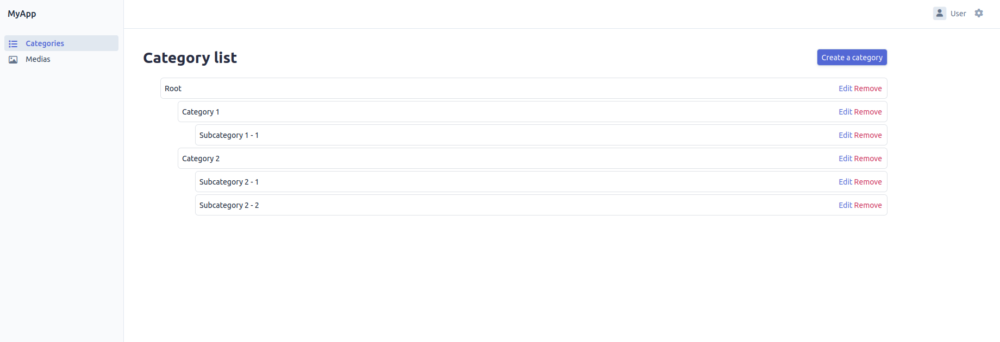
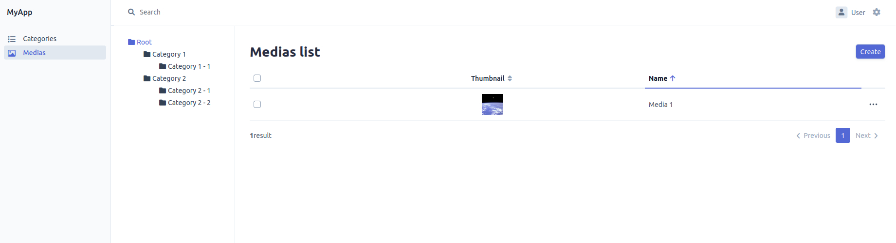
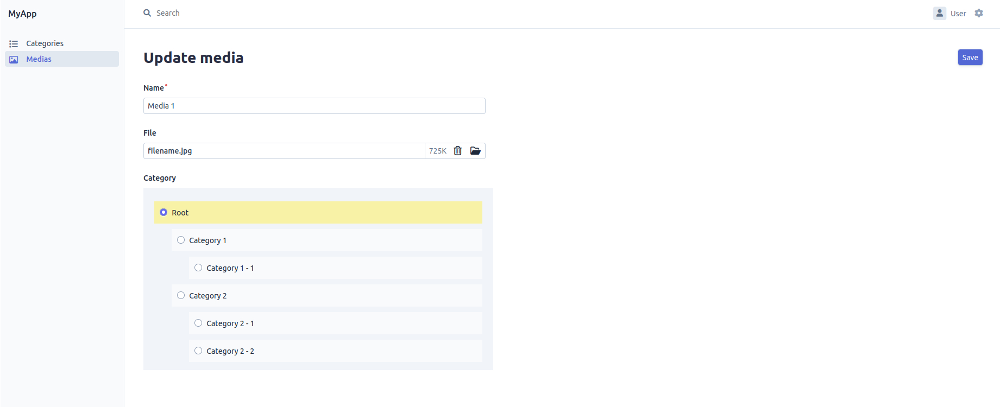

# Umanit EasyAdmin Tree Bundle

Plugin to add category tree features for EasyAdmin

## Features

- [x] Display of content's entries as a tree structure on index page
- [x] Filter content's entries through a tree sidebar on index page
- [x] Provide a TreeField to manage tree structures on forms

## Installation

`$ composer require umanit/easyadmin-tree-bundle`

## Configuration

The templates paths needs to be declared in your Twig configuration :

```yaml
twig:
  paths:
    '%kernel.project_dir%/vendor/umanit/easyadmin-tree-bundle/Resources/views': UmanitEasyAdminTreeBundle
```

This bundle relies on StofDoctrineExtensionsBundle, so make sure it is configured properly : [documentation](https://symfony.com/bundles/StofDoctrineExtensionsBundle/current/index.html). 
You need to :
* add tree extension to your mapping : 
```yaml
doctrine:
    orm:
        entity_managers:
            default:
                mappings:
                    gedmo_tree:
                        type: annotation
                        prefix: Gedmo\Tree\Entity
                        dir: "%kernel.project_dir%/vendor/gedmo/doctrine-extensions/src/Tree/Entity"
                        alias: GedmoTree # (optional) it will default to the name set for the mapping
                        is_bundle: false
```
* activate the tree extension :
```yaml
stof_doctrine_extensions:
    default_locale: en_US
    orm:
        default:
            tree: true
```

## Usage

1. [Administer a category tree](#administer-a-category-tree)
1. [Add a tree sidebar](#add-a-tree-sidebar)
1. [Use TreeField in your forms](#use-treefield-in-your-forms)

### Administer a category tree

Create you category entity by extending AbstractTreeItem :

```php
<?php
// src/Entity/Category.php
namespace App\Entity;

use Doctrine\DBAL\Types\Types;
use Doctrine\ORM\Mapping as ORM;
use Umanit\EasyAdminTreeBundle\Entity\AbstractTreeItem;

#[ORM\Entity]
#[ORM\Table(name: 'app_category')]
class Category extends AbstractTreeItem
{
...
}
```

Create a CRUD controller for your categories by extending the TreeCrudController
```php
<?php
// src/Controller/Admin/MyTreeCrudController.php
namespace App\Controller\Admin;

use App\Entity\Category;
use EasyCorp\Bundle\EasyAdminBundle\Config\Action;
use EasyCorp\Bundle\EasyAdminBundle\Config\Actions;
use EasyCorp\Bundle\EasyAdminBundle\Config\Crud;
use EasyCorp\Bundle\EasyAdminBundle\Field\BooleanField;
use EasyCorp\Bundle\EasyAdminBundle\Field\IdField;
use EasyCorp\Bundle\EasyAdminBundle\Field\SlugField;
use EasyCorp\Bundle\EasyAdminBundle\Field\TextareaField;
use EasyCorp\Bundle\EasyAdminBundle\Field\TextField;
use Umanit\EasyAdminTreeBundle\Controller\TreeCrudController;
use Umanit\EasyAdminTreeBundle\Field\TreeField;

class MyTreeCrudController extends TreeCrudController
{
    public static function getEntityFqcn(): string
    {
        // return your Category entity FQCN
        return Category::class;
    }

    protected function getEntityLabelProperty(): string
    {
        // return the property of your category to use as a label in tree display
        return 'name';
    }
}
```

Enable the Crud in your EasyAdmin Dashboard : 

```php
    public function configureMenuItems(): iterable
    {
        return [
            ...
            MenuItem::linkToCrud('Categories', 'fas fa-list', Category::class),
            ...
        ];
    }
```

### Add a tree sidebar

To enable the tree sidebar to an existing CRUDController, you have to make it extend AbstractCategorizedCrudController :

```php
<?php
// src/Controller/Admin/MediaCrudController.php
namespace App\Controller\Admin;

use App\Entity\Category;
use App\Entity\Media;
use Umanit\EasyAdminTreeBundle\Controller\AbstractCategorizedCrudController;

class MediaCrudController extends AbstractCategorizedCrudController
{
    public static function getEntityFqcn(): string
    {
        return Media::class;
    }

    public function configureCrud(Crud $crud): Crud
    {
        $crud = parent::configureCrud($crud);

        // ...
    }
    
    public static function getCategoryFqcn(): string
    {
        // The FQCN of the entity to use as a category (should extend AbstractTreeItem)
        return Category::class;
    }

    protected static function getCategoryPropertyName(): string
    {
        // the name of the category property for the entity managed by this CRUDController
        return 'category';
    }

    protected function getDefaultCategoryId(): int
    {
        // The id of the category that will be used as default filter for the index page of your CRUD 
        return $this->getCategoryRepository()->findOneBy(['parent' => null])->getId();
    }
}
```

### Use TreeField in your forms

You just need to add the field in the EasyAdmin configureFields function : 

```php
<?php
// src/Controller/Admin/MediaCrudController.php
namespace App\Controller\Admin;

use Umanit\EasyAdminTreeBundle\Field\TreeField;

class MediaCrudController extends AbstractCategorizedCrudController
{

    public function configureFields(string $pageName): iterable
    {
        return [
            // ...
            TreeField::new('category', 'My category'),
            // ...
        ];
    }
```

If you wish to use the tree field with a ManyToMany relation, just set field attribute `multiple` to true :
```php
<?php
// src/Controller/Admin/MediaCrudController.php
namespace App\Controller\Admin;

use Umanit\EasyAdminTreeBundle\Field\TreeField;

class MediaCrudController extends AbstractCategorizedCrudController
{

    public function configureFields(string $pageName): iterable
    {
        return [
            // ...
            $pageName === 'index'
                ? AssociationField::new('categories', 'My categories')
                : TreeField::new('categories', 'My categories')
                    ->setFormTypeOption('multiple', true),
            // ...
        ];
    }
```

### Screenshots
Tree structure on index page


Tree sidebar


TreeField in forms


### TODO 

List of needed improvements : 
- fold/unfold categories
- reorder category items with drag'n drop
- prefill category in TreeField with current category in the sidebar
- improve front (design, css)